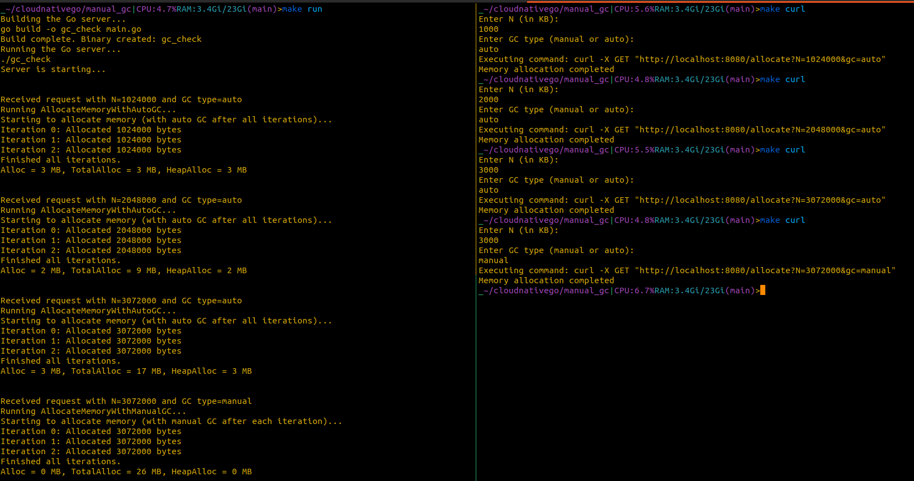

# Manual vs Auto Garbage Collection Simulation

This project simulates the effects of **manual** and **automatic** garbage collection (GC) on memory usage in a Go application. It demonstrates the differences between these two memory management approaches and allows you to observe the impact on memory allocation and usage.

## Key Concepts

- **Manual Garbage Collection**: The application manually triggers garbage collection at specific points during memory allocation.
- **Automatic Garbage Collection**: Go's built-in garbage collector automatically handles memory cleanup during the execution of the program.

### Memory Allocation Functions

Two main functions handle memory allocation in this project: **manual** and **automatic** garbage collection.

#### `AllocateMemoryWithManualGC` (Manual Garbage Collection)

This function simulates memory allocation while manually triggering garbage collection after each iteration. The steps involved are:

1. **Memory Allocation**: A slice of bytes (`[]byte`) is created for each iteration, with a size of `N` bytes.
2. **Memory Population**: The slice is filled with byte values, where each byte is the result of `j % 256` to ensure that it fits within a single byte.
3. **Manual Garbage Collection**: After each iteration, the `runtime.GC()` function is called to manually trigger garbage collection, allowing the system to clean up unused memory.

Here’s the code for the function:

```go
// AllocateMemoryWithManualGC allocates memory and triggers garbage collection manually after each iteration
func AllocateMemoryWithManualGC(N int) {
    fmt.Println("Starting to allocate memory (with manual GC after each iteration)...")

    // Allocate memory by creating and discarding slices
    for i := 0; i < 3; i++ {
        structure := make([]byte, 0, N) // Create a new slice of bytes
        for j := 0; j < N; j++ {
            structure = append(structure, byte(j%256)) // Add bytes N times (mod 256 to fit in a byte)
        }
        fmt.Printf("Iteration %d: Allocated %d bytes\n", i, len(structure))
        runtime.GC() // Trigger garbage collection manually after each iteration
        // The structure slice goes out of scope here, and the GC can clean it up
    }

    fmt.Println("Finished all iterations.")
}
```

- **Iterations**: The function runs the memory allocation process for **3 iterations**. After each iteration, it calls the garbage collector manually to free memory used in the previous cycle.
- **Expected Behavior**: The manual garbage collection helps keep the memory footprint low after each iteration, as unused memory is explicitly cleaned up.

#### `AllocateMemoryWithAutoGC` (Automatic Garbage Collection)

This function also allocates memory but relies on Go's built-in garbage collector to handle cleanup after all iterations are completed.

1. **Memory Allocation**: A slice of bytes is created and populated in each iteration, similar to the manual GC function.
2. **No Manual Garbage Collection**: The function does not trigger garbage collection manually. Instead, Go automatically handles memory cleanup when it detects that the slices are no longer in use.

Here’s the code for this function:

```go
// AllocateMemoryWithAutoGC allocates memory and triggers garbage collection at the end of all iterations
func AllocateMemoryWithAutoGC(N int) {
    fmt.Println("Starting to allocate memory (with auto GC after all iterations)...")

    // Allocate memory by creating and discarding slices
    for i := 0; i < 3; i++ {
        structure := make([]byte, 0, N) // Create a new slice of bytes
        for j := 0; j < N; j++ {
            structure = append(structure, byte(j%256)) // Add bytes N times (mod 256 to fit in a byte)
        }
        fmt.Printf("Iteration %d: Allocated %d bytes\n", i, len(structure))
        // The structure slice goes out of scope here, and the GC can clean it up
    }

    fmt.Println("Finished all iterations.")
}
```

- **Iterations**: Like the manual GC function, this runs for **3 iterations** but without manual garbage collection between iterations.
- **Expected Behavior**: Go's built-in garbage collector will clean up unused memory once the slices go out of scope at the end of the function. However, since no explicit garbage collection is triggered, memory consumption may be higher at the end of the iterations.

### How to Run the Project

1. **Clone the Repository:**

   ```bash
   git clone <repository-url>
   cd <repository-directory>
   ```

2. **Build the Server:**

   Use the `Makefile` to build the Go server:

   ```bash
   make build
   ```

3. **Run the Server:**

   Start the server by running:

   ```bash
   make run
   ```

   The server will listen on port `8080`.

4. **Simulate Memory Allocation:**

   Use the `curl` target to simulate memory allocation:

   ```bash
   make curl
   ```

   This will prompt you to enter two parameters:
   - `N` (in KB): The amount of memory to allocate.
   - `gc` (manual or auto): The type of garbage collection to use.

   Example:

   ```bash
   Enter N (in KB):
   1000
   Enter GC type (manual or auto):
   auto
   Executing command: curl -X GET "http://localhost:8080/allocate?N=1024000&gc=auto"
   ```

   This will allocate the specified amount of memory and display the memory stats.

### Memory Stats

The server will provide memory statistics after the allocation, including:

- **Alloc**: The amount of memory allocated.
- **TotalAlloc**: The total amount of memory allocated during the lifetime of the program.
- **HeapAlloc**: The amount of memory allocated from the heap.

These stats are displayed after the memory allocation request is processed.

### Example Screenshot

Here is an example of the expected output in the terminal:



---

### Next Steps

- Experiment with different values for memory allocation and GC types to see the differences in memory usage.
- Try optimizing the memory allocation functions to reduce memory usage and improve performance.
